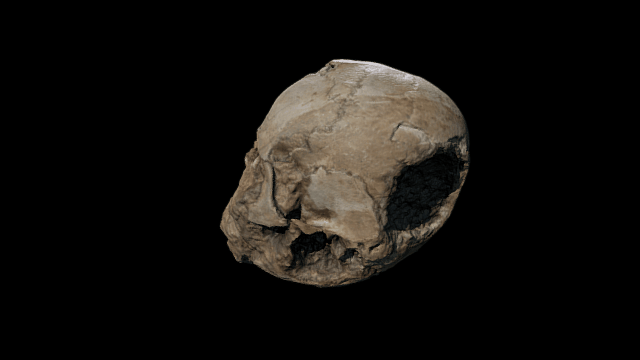

 

# The Jericho Skull

A plastered human skull; the skull was taken as the base and the features of the face were modelled on it in plaster. One eye is made from a bivalve shell divided in two. The other has one, smaller, complete shell in place and is missing its twin.

Culture/period: Pre-Pottery Neolithic B (8500 BC- 6000BC)

* Height: 17 centimetres 
* Width: 14.6 centimetres 
* Length: 11.2 centimetres (nose to top Y-suture) 
* Length: 16.4 centimetres (nose to back Y-suture) 
* Length: 13.4 centimetres (between top parietals) 
* Length: 12.8 centimetres (between side parietals) 
* Depth: 18 centimetres 
* Weight: 3.4 kilograms

Collection online record: http://bit.ly/jerichoSkull3D

Google Cultural Institute: https://www.google.com/culturalinstitute/beta/asset/swH1nFuqOHaDLQ

Street view location: http://bit.ly/2aNS7ui

Current World Archaeology: http://bit.ly/23YOjI9

# License

The files in this repository are made available under a CC BY-NC-SA license.

# Credits

Created from 138 photographs (Nikon D5100/ OnePlus3 mobile) and Photoscan by Daniel Pett.
